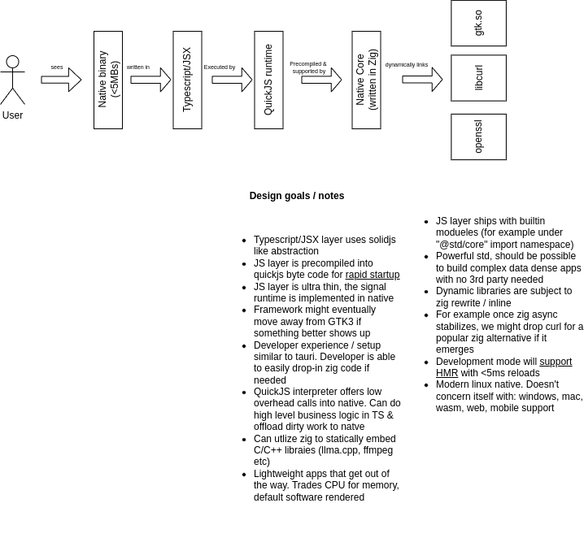

# Mirai-GTK

> ⚠️ Incomplete experimental project

### About

Write native GTK/Linux apps with Typescript

### Architecture / Design notes

TLDR: Tauri-like development model. SolidJS-like API for building the GUI. Batteries included std. Native GTK applications. Focus on startup and minimal application footprint. 

### References / Learn more

* QuickJS [https://github.com/bellard/quickjs](https://github.com/bellard/quickjs)
* Zig [https://ziglang.org/](https://ziglang.org/)
* Gtk [https://www.gtk.org/](https://www.gtk.org/)
* Tree-sitter [https://tree-sitter.github.io/tree-sitter/](https://tree-sitter.github.io/tree-sitter/)
* Nix [https://nixos.org/](https://nixos.org/)